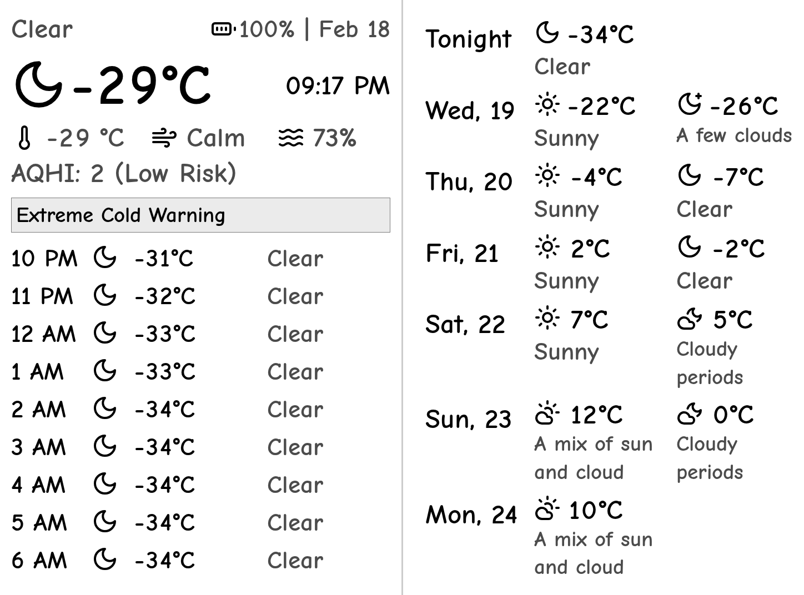

# 現在開発中で完全な機能は実装されていません
# Kindle Weather Dashboard (PaperWhite 6th Gen 用)

こんにちは！👋 これは、Kindle に天気情報を表示するために作成した楽しい小さなプロジェクトの日本用フォークです。Livedoor互換APIの天気データを利用するように設計される予定です。

このサーバーは、次のブログ記事で紹介している Kindle ダッシュボード用に使用しています：
[Reviving my Kindle PW7](https://terminalbytes.com/reviving-kindle-paperwhite-7th-gen/)



*👆 これは Kindle での表示例です！（Kindle 画面に合わせて90°回転しています）*

## これは何？

このダッシュボードは、Kindle に適したクリーンな天気情報の表示を生成します。以下の情報が含まれます(データに合わせて変更予定)：
- 現在の気温と天気状況
- 体感温度
- 風速と湿度
- 大気質健康指数（AQHI）
- 時間ごとの天気予報
- 日ごとの天気予報（昼・夜の分割表示）
- Kindle のバッテリー残量
- 天気警報（発生時のみ）

## ☘️ プロジェクトの現状

このプロジェクトは、個人的に作ったラフなものです。一応動作しますが、バグがあるかもしれませんし、コードの整理も必要です。ただし、カナダに住んでいて Kindle に天気を表示したいなら、良いスタート地点になるかもしれません！

## 🛠️ 技術スタック

- **バックエンド**：Node.js（TypeScript）
- **Web フレームワーク**：Express
- **画像処理**：
  - Playwright（HTML ダッシュボードのキャプチャ用）
  - Sharp（画像処理と Kindle 向けの変換）
- **天気データ**：Environment Canada API（利用許可があるか不明なので自己責任で使用してください）
- **アイコン**：Lucide icons（統一感のあるクリーンな天気アイコン）
- **コンテナ化**：Docker & Docker Compose

## 🎨 クールな機能

- **レスポンシブデザイン**：CSS Grid と Flexbox を活用
- **動的サイズ調整**：テキストの長さに応じて自動スケーリング
- **Kindle 最適化**：画像を白黒に変換し、Kindle 向けに回転
- **アイコンマッピング**：Environment Canada の天気コードを Lucide アイコンにマッピング
- **バッテリー表示**：Kindle のバッテリー残量をアイコン付きで表示

## 🚀 始め方

### 必要なもの

- Docker
- Docker Compose
- 天気データへの興味 🌤️

### クイックスタート

1. コードを取得：

```
git clone git@github.com:terminalbytes/kindle-dashboard.git
cd kindle-dashboard
```

2. `api-weather.ts` ファイルで場所（緯度・経度）を変更。
3. 起動する：

```
docker-compose up -d
```

これにより：
- Docker イメージをビルド
- 天気サービスを起動
- ポート 8080 で利用可能に

### 天気ダッシュボードの生成

新しいダッシュボードを生成し、バッテリー残量を更新するには：

```
curl http://localhost:8080/battery/75  # 75 を実際のバッテリー残量に変更
```

新しいダッシュボードは次の URL で利用可能：

[http://localhost:8080/dash.png](http://localhost:8080/dash.png)

## 🔧 開発メモ

### 天気アイコンと気象条件

`icon-codes.ts` という便利なスクリプトがあり、Environment Canada の天気アイコンコードをそれぞれの気象条件にマッピングします。このスクリプトは API レスポンスを解析して包括的なマッピングを作成するため、新しいアイコンを追加したり、各コードの意味を理解するのに役立ちます。

### API 実装

メインの天気ダッシュボード生成は `api-weather.ts` で行われます。
1. Environment Canada から天気データを取得
2. 取得した天気コードを Lucide アイコンにマッピング
3. レスポンシブな HTML ダッシュボードを生成
4. Playwright を使ってダッシュボードを画像キャプチャ
5. Sharp で画像を加工し Kindle 向けに最適化

### ローカル開発

ローカルで開発したい場合：

```
docker build -t kindle-dashboard .
docker run -p 8080:8080 kindle-dashboard
```

## 📝 設定

- デフォルトの場所はカナダ・アルバータ州メディスンハット（`api-weather.ts` の `WEATHER_LOCATION` を変更して設定）
- 画像は `public` ディレクトリに保存
- デフォルトのポートは 8080
- ダッシュボードのサイズは Kindle に最適化（1024x758）


## ⚖️ License

MIT License - Go wild! Just don't blame me if your Kindle shows the wrong weather 😉

Copyright (c) 2024 terminalbytes

Permission is hereby granted, free of charge, to any person obtaining a copy
of this software and associated documentation files (the "Software"), to deal
in the Software without restriction, including without limitation the rights
to use, copy, modify, merge, publish, distribute, sublicense, and/or sell
copies of the Software, and to permit persons to whom the Software is
furnished to do so, subject to the following conditions:

The above copyright notice and this permission notice shall be included in all
copies or substantial portions of the Software.

THE SOFTWARE IS PROVIDED "AS IS", WITHOUT WARRANTY OF ANY KIND, EXPRESS OR
IMPLIED, INCLUDING BUT NOT LIMITED TO THE WARRANTIES OF MERCHANTABILITY,
FITNESS FOR A PARTICULAR PURPOSE AND NONINFRINGEMENT. IN NO EVENT SHALL THE
AUTHORS OR COPYRIGHT HOLDERS BE LIABLE FOR ANY CLAIM, DAMAGES OR OTHER
LIABILITY, WHETHER IN AN ACTION OF CONTRACT, TORT OR OTHERWISE, ARISING FROM,
OUT OF OR IN CONNECTION WITH THE SOFTWARE OR THE USE OR OTHER DEALINGS IN THE
SOFTWARE. 
